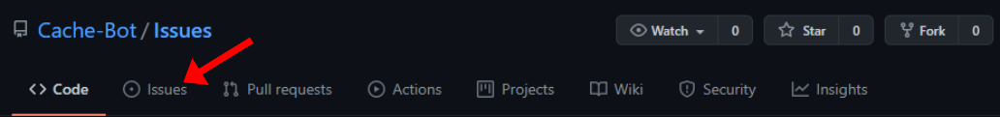
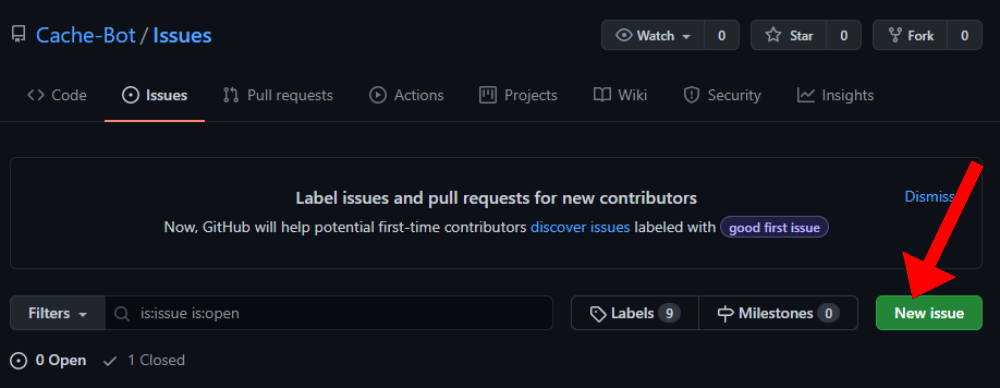

### Issues
Any issues you may have with Cache such as a bug, error or you just need help

# How to open an issue:

Start by locating the image tab.

Click the button below Marked "New Issue"

Now you will be given a page, make sure the title accuratly reflects the issue and that the description contains steps on how to replicate the issue and what the issue actually is

Now you should await a response, please bear in mind developers may be slow to respond and we aren't active 24/7/365 so please allow up to a week for the issue to be solved.
